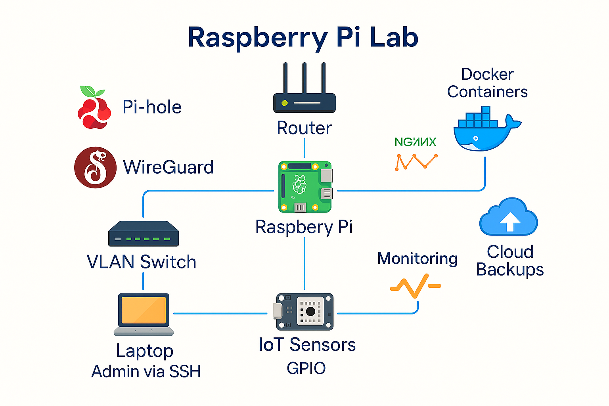

# 🖥️ Raspberry Pi IT Lab  

  
  

Un lab open source basé sur **Raspberry Pi** pour explorer les domaines :  
- Réseaux (VLAN, DHCP, VPN, firewall)  
- Systèmes (Linux, monitoring, sauvegardes)  
- Cybersécurité (pentest, IDS, honeypots)  
- DevOps (Docker, Ansible, CI/CD miniature)  
- IoT (capteurs et projets GPIO)  

## 📂 Structure du dépôt  

- `docs/` → documentation et tutoriels pratiques  
- `scripts/` → scripts Bash, Python, PowerShell pour automatiser le lab  
- `images/` → schémas réseau, architecture et captures  
- `assets/` → visuels intégrés au README  

## 📘 Documentation
- [Installation & configuration de base](docs/setup.md)  
- [Configuration réseau](docs/networking.md)  

## 🚀 Premiers tutoriels  

1. Installation Raspberry Pi OS & configuration SSH  
2. Montage d’un mini serveur web (Apache/Nginx)  
3. Mise en place d’un Pi-hole (DNS et filtrage)  
4. Docker sur Raspberry Pi pour héberger des services  

## 📊 Exemples d’utilisation  

### Wi-Fi (Raspberry Pi)  
```bash
bash scripts/bash/wifi_config.sh MonSSID MonMotDePasse

Monitoring CPU

bash scripts/bash/cpu_temp.sh

Serveur web avec Docker

docker run -d -p 80:80 nginx

🛠️ Avant d’exécuter

Installer les dépendances si nécessaire :

pip install -r requirements.txt

🤝 Contribution

Les contributions sont bienvenues 🎉 :
	1.	Forkez le repo
	2.	Créez une branche (feat/mon-tutoriel)
	3.	Ajoutez votre doc/tutoriel dans docs/ ou vos scripts dans scripts/
	4.	Proposez une Pull Request

📜 Licence

Ce projet est distribué sous la licence MIT.
Vous êtes libres de l’utiliser, le modifier et le partager.